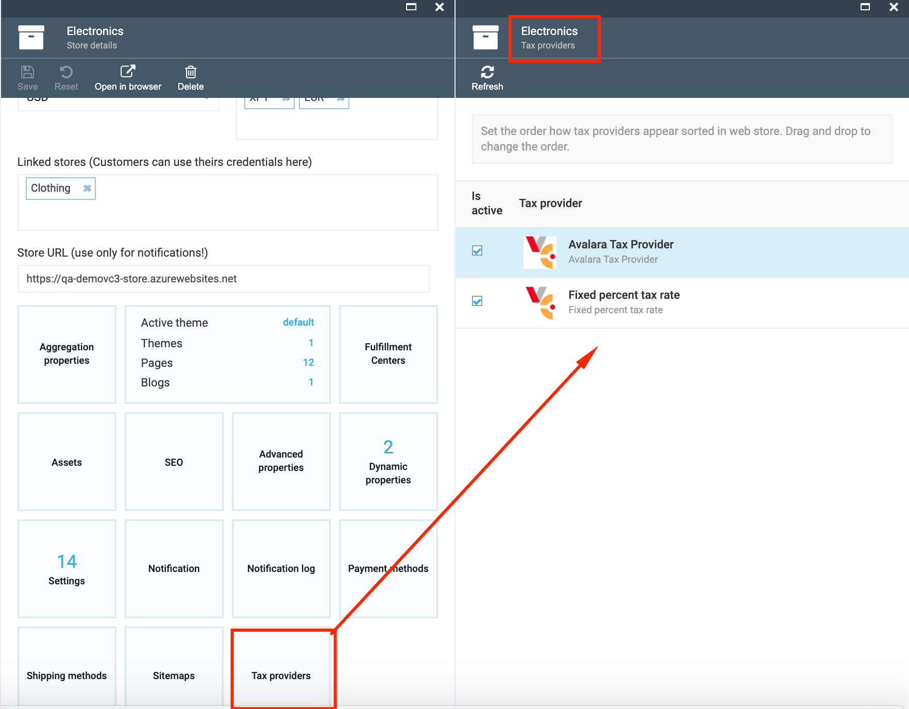
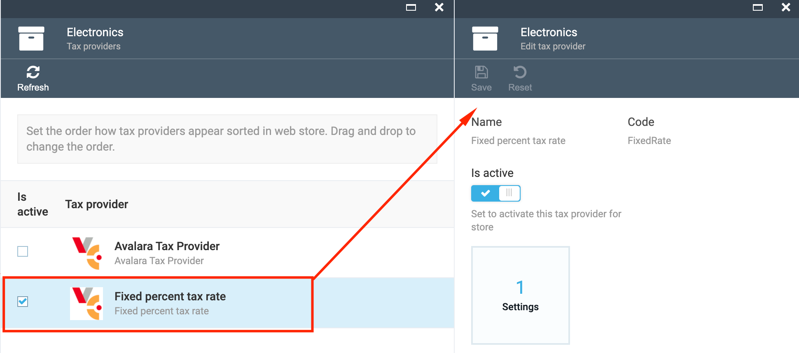
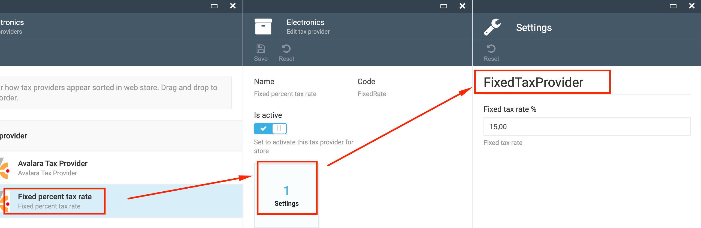

# Overview

The Tax Module provides the ability to extend tax provider list with custom providers and also provides an interface and API for managing these tax providers.

The tax module is an engine for tax calculations.

## Key Features

1. Extend the custom tax providers;
1. Tax providers registration using the code;
1. Display the list of available tax providers on UI;
1. Edit tax provider settings on UI;
1. Connect the tax providers to the selected Store;
1. API to work with tax provider list.

## Scenarios

### View Tax Provider

1. Go to More->Stores->select the Store;
1. On Store details blade select the 'Tax providers' widget;
1. The list available tax providers will be displayed on 'Tax providers' blade;
1. Select a tax provider from the list;
1. The following details will be displayed:

     1. Tax provider name;
     1. Tax provider code;
     1. 'Is active' button- used to activate or de-activate the tax provider;
     1. 'Settings' widget.

### Edit Tax Provider Settings

1. Select the 'Settings' widget on tax provider details blade;
1. Change the fixed tax rate if needed;
1. Save the changes if any editing was made.

