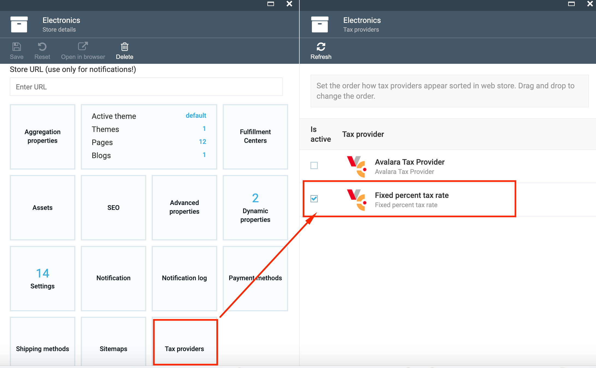

# Overview

The Tax module provides a flexible way to evaluate taxes by using different tax providers and core abstractions for custom tax providers. It allows easy addition of custom rules for tax calculation.

The module includes FixedRateTaxProvider as a built-in tax provider.

The module provides an API to work with the tax provider list and allows you to connect the tax providers to a selected store. The list of available tax providers can be viewed and edited on the UI.


## Key Features

1. **Flexible tax calculation**: Evaluate tax using different tax providers, including the built-in FixedRateTaxProvider, and easily add custom rules for tax calculation.
1. **UI integration**: Display the list of available tax providers on the user interface and edit their settings directly from the platform.
1. **Store-level tax configuration**: Connect tax providers to specific stores and configure different tax rates based on location, product type, or other parameters.
1. **Customizable tax providers**: Implement custom tax providers by creating new modules that inherit from the abstract TaxProviderBase class.
1. **Programmatic tax provider registration**: Register new tax providers programmatically by implementing the ITaxProvider interface.
1. **API access**: Access the list of available tax providers and their settings via the public API.

## Default Providers
1. FixedRateTaxProvider is a built-in tax provider included in the Virto Commerce Tax Module. It calculates taxes based on fixed rates.
1. [Avalara.Tax](https://github.com/VirtoCommerce/vc-module-avatax)  real time integration with Avalara Tax automation. This module is officially certified by Avalara to be compatible with Avalara API.

## Scenarios

### View Tax Provider

1. Go to More->Stores->select the Store;
1. On Store details blade select the 'Tax providers' widget;
1. The list available tax providers will be displayed on 'Tax providers' blade;
1. Select a tax provider from the list;
1. The following details will be displayed:

     1. Tax provider name;
     1. Tax provider code;
     1. 'Is active' button- used to activate or de-activate the tax provider;
     1. 'Settings' widget.




### Edit Tax Provider Settings

1. Select the 'Settings' widget on tax provider details blade;
1. Change the fixed tax rate if needed;
1. Save the changes if any editing was made.


## Settings

You can disable FixedRateTaxProvider by using `TaxModule:FixedRateTaxProvider:Enabled` setting in appsettings.json.

```json
"TaxModule":
{
    "FixedRateTaxProvider":
    {
        "Enabled": true
    }
},
...
```
